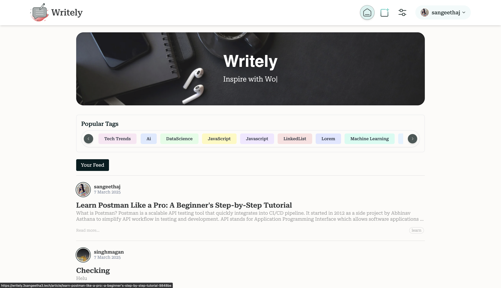

<h1 align="center">✍️ Writely - Modern Blogging Platform</h1>
<p align="center">
  
</p>
<p align="center">
  <a href="https://wakatime.com/badge/user/018d8a5a-cab1-4ae5-8c4a-50cef4948510/project/0c780a41-1f8b-4729-9422-d23507e75908">
    
  </a>
</p>
<p align="center">
  <a href="https://skillicons.dev">
    
  </a>
</p>

## 📝 What is Writely?

Writely is a modern, feature-rich blogging platform that empowers users to create, publish, and interact with high-quality content. Built with a sleek UI and comprehensive text editing capabilities, Writely offers an immersive writing and reading experience. The platform combines powerful article management tools with social features to create a vibrant community of writers and readers.

## Preview 

<p align="center">
  
  <em>Home Page</em>
</p>

<p align="center">
  
  <em>Home Page (Continued)</em>
</p>

<p align="center">
  
  <em>Article Page</em>
</p>

<p align="center">
  
  <em>Sign In Page</em>
</p>

<p align="center">
  
  <em>Sign Up Page</em>
</p>

<p align="center">
  
  <em>User Profile</em>
</p>

<p align="center">
  
  <em>User Profile (Continued)</em>
</p>

<p align="center">
  
  <em>Settings Page</em>
</p>


## ✨ Key Features

### 📑 Content Creation & Management
- **Rich Text Editor**: Advanced editing with Jodit integration
- **Article Publishing**: Support for tags and categories
- **Deletion Management**: Article removal with confirmation flow

### 🎨 User Experience
- **Modern UI/UX**: Elegant animations with AOS library
- **Responsive Design**: Optimized for all device sizes
- **Loading Skeletons**: Enhanced perceived performance
- **Theme Support**: Toggle between dark and light modes

### 👤 Profile & User Management
- **Custom Profiles**: Personalized avatars and bio sections
- **Contribution Tracking**: Article history with heatmap visualization
- **Writer Analytics**: Author statistics (streaks, active periods)
- **Account Security**: Email verification system

### 🤝 Social Interaction
- **Community Engagement**: Comprehensive commenting system
- **Article Metrics**: Read time, comment counts, and popularity tracking
- **Network Building**: User following capabilities
- **Content Discovery**: Explore trending and popular tags

### 🖥️ Content Display
- **Secure Rendering**: Sanitized HTML with DOMPurify
- **Markdown Support**: Write in markdown or rich text
- **Code Highlighting**: Syntax highlighting for code blocks

## 🛠️ Tech Stack

### Frontend
<p align="center">
  <a href="https://skillicons.dev">
    
  </a>
</p>

- **Core**: React.js (v18.3.1), Vite (v5.3.1)
- **Routing**: React Router v6 (v6.24.1)
- **State Management**: React Query (v5.51.5), Valtio (v1.13.2)
- **Styling**: Tailwind CSS (v3.4.13), MUI Components (v6.1.2), Emotion (v11.13.3)

### Backend
<p align="center">
  <a href="https://skillicons.dev">
    
  </a>
</p>

- **Server**: Node.js, Express
- **Database**: MongoDB with Mongoose ODM
- **Authentication**: JWT, Bcrypt
- **Media Storage**: Cloudinary
- **Email**: Nodemailer
- **File Handling**: Multer
- **Scheduling**: Node-cron

### UI Components & Libraries
- **Rich Text**: Jodit React (v5.2.5)
- **Icons**: Lucide React (v0.477.0), React Icons (v5.2.1)
- **Animations**: AOS (Animate On Scroll), Lottie React (v2.4.1), Typed.js (v2.1.0)
- **Form Handling**: Formik (v2.4.6), Yup validation (v1.5.0)
- **Security**: DOMPurify (v3.2.4)
- **Utilities**: Axios (v1.7.2), Lodash-es (v4.17.21), Classnames (v2.5.1)

## 🚀 Getting Started

### Prerequisites
- Node.js (v14+)
- npm or yarn
- Git
- MongoDB instance (local or Atlas)
- Cloudinary account (for image uploads)
- Gmail account (for email verification)

### Frontend Setup

1. **Clone the repository**
```bash
git clone https://github.com/your-username/Writely.git
cd Blogging-website-Frontend
```
2. **Install dependencies**
```bash
npm install
```
3. **Environment setup - Create a .env file:**
```bash
VITE_API_URL=your_backend_api_url
VITE_GITHUB_TOKEN=your_github_token
```
4. **Start development server**
```bash
npm run dev
```
5. **Build for production**
```bash
npm run build
```

### Backend Setup

1. **Navigate to backend directory:**
```bash
cd Blogging-website-Backend
```
2. **Install dependencies**
```bash
npm install
```
3. **Create a .env file with these variables:**
```bash
PORT=3000
DATABASE_URI=your_mongodb_connection_string
ACCESS_TOKEN_SECRET=your_jwt_secret_key
CLOUDINARY_CLOUD_NAME=your_cloudinary_cloud_name
CLOUDINARY_API_KEY=your_cloudinary_api_key
CLOUDINARY_API_SECRET=your_cloudinary_api_secret
EMAIL=your_gmail_address
EMAIL_PASSWORD=your_gmail_app_password
FRONTEND_URL=your_frontend_url
```
1. **Start the server:**
```bash
npm run server
```
## 📁 Project Structure

### Frontend Structure
```
blogging-website/
├── public/             # Static files
├── src/
│   ├── assets/         # Images, icons, animations
│   ├── components/     # Reusable components
│   ├── hooks/          # Custom React hooks
│   ├── pages/          # Main application pages
│   ├── App.jsx         # Main application component
│   ├── constants.js    # Application constants
│   └── main.jsx        # Application entry point
├── .env                # Environment variables
└── vite.config.js      # Vite configuration
```

### Backend Structure
```
Blogging-website-Backend/
├── api/                # API entry point
├── config/             # Configuration files
├── controllers/        # Request handlers
├── middleware/         # Custom middleware
├── models/             # Database models
├── routes/             # API routes
├── uploads/            # Temporary upload directory
└── utils/              # Utility functions
```

## 💡 Key Implementation Details

### Article Editor
The Editor component uses Formik for form state management and JoditField for rich text editing.

# Security Implementation

* **CORS configuration** restricts domain access
* **JWT verification middleware** protects authenticated routes
* **Password hashing** ensures secure credential storage
* **Input validation** prevents malicious data

## Authentication Flow

1. User registers with email, username, and password
2. Verification email is sent via Nodemailer
3. User verifies email by clicking the link
4. User logs in and receives JWT token
5. Token is used for authenticated API requests

## 👤 Author

**Jadamal Sangeetha Choudhary**

## 📄 License

This project is licensed under the MIT License - see the LICENSE file for details.

## 🤝 Contributing

Contributions, issues, and feature requests are welcome! Feel free to check the issues page.

## ⭐ Show your support

Give a ⭐️ if this project helped you!
